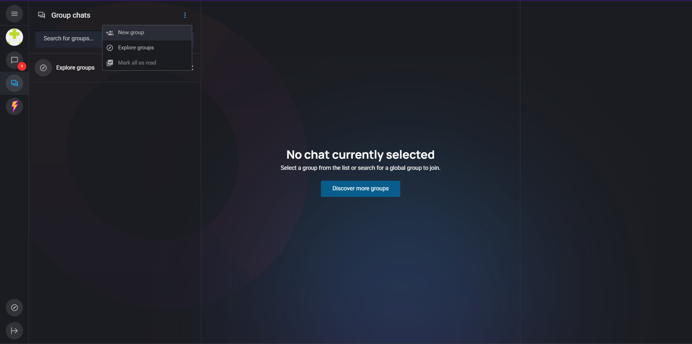

# 📬🤖 OnChain AI with OpenChat

Welcome to the **ICP AI Hackathon - OpenChat Integration Template**! This repository showcases how to build an **AI-powered bot** for [OpenChat](https://oc.app), a decentralized messaging dApp on the Internet Computer. This bot runs as a service that integrates with the OpenChat bot SDK and connects to your local OpenChat instance.

This template is based on the official [open-chat-bots](https://github.com/open-chat-labs/open-chat-bots) repository developed by the OpenChat team.
> ⚠️ **Note:** The OpenChat Bot SDK is currently under active development and subject to frequent changes.  
> To ensure stability during the hackathon, we’ve pinned this template to a specific version to avoid breaking changes.  
> If you'd like to explore the latest updates, features, or contribute directly, please refer to the official [open-chat-bots](https://github.com/open-chat-labs/open-chat-bots) repository.

---

## ✨ Overview

- 💬 **Create a custom messaging bot** using the OpenChat SDK
- 🧠 **Integrate OpenAI or any LLM** to power your bot’s replies
- 🧪 **Run and test locally** using OpenChat’s Docker image
- 🌍 **Connect to the IC backend** to fetch data or trigger actions

---

## 🚀 Getting Started

### 1. Prerequisites

- Fork this repo and open a new codespace (we recommend you to select the 4-core machine).
- After it's creation you can select to open the codespace directly in vs code.
- Everything should be setup correctly for you to run the following commands.

---

### 2. Run OpenChat Locally

Pull and run the OpenChat container:

```bash
docker info  # Check that Docker is running
docker run --platform linux/amd64 -d -p 5001:80 -p 8080:8080 --name open-chat openchatlabs/open-chat:latest@sha256:78bd4571eab0066dbec01dc3a7cab218b76f65061a6b5976c095242f4eac20c6
```

Wait a few minutes for everything to setup correctly. Once it’s running, access OpenChat UI via:

```
http://localhost:5001
```

---

### 3. Start dfx & Deploy the Bot

```bash
cd open-chat-bots/rs && dfx start --clean --background
./../scripts/deploy_echo_bot.sh
```

Once the bot is deployed, its description will be available at:

```bash
http://<YOU_CANISTER_ID>.raw.localhost:4943
```

---

### 4. Register your bot on Openchat and start messaging it!

Follow these steps to register and interact with your bot in your local OpenChat instance:

1. **Register with Internet Identity**

   - Open [http://localhost:5001](http://localhost:5001)
   - Click "Sign in", register using Internet Identity, and create a new passkey.
   - Choose a username. You can reuse the passkey later to keep your progress.  
     

2. **Create a Group Chat**

   - Click the **Group chats** icon on the left sidebar.
   - Tap the **three dots** at the top left of your screen and select **"New group"**.
   - Give it a name and accept the default configuration.  
     

3. **Register Your Bot**

   - Inside the group chat, type the command:
     ```
     /register_bot
     ```
   - This will prompt you to enter bot information.  
     

4. **Fill Out Bot Info**

   - Use the information provided by the deployment script (`deploy_echo_bot.sh`) to fill out the form.  
     

5. **Add the Bot to Your Group**

   - Click the **group members** icon at the top right of the chat.
   - Select **"Add bots"** to open the bot list window.  
     

6. **Grant Bot Authorizations**

   - Review the authorizations the bot requests.
   - Accept or refuse permissions based on your preferences.  
     

7. **Start Messaging the Bot**
   - Use any bot commands you've implemented.
   - For example, test the `/echo` command which repeats your input.  
     

You're all set! You can now interact with your bot in the group chat.

---

## 🛠 Customize Your Bot

The default bot is just an example. You can modify its behavior by editing `/open-chat-bots/rs/canister/examples` and linking it to your own AI backend or tools.

---

## 📚 Learn More

- [OpenChat](https://oc.app)
- [OpenChat Bot SDK](https://github.com/open-chat-labs/open-chat-bots)
- [ICP Developer Docs](https://internetcomputer.org/docs)
- [Docker Installation](https://docs.docker.com/get-docker/)

---

**Now go build something amazing 🤖📬 with OpenChat!**
